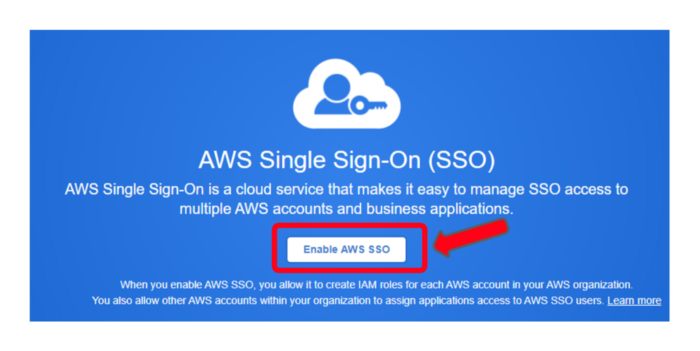
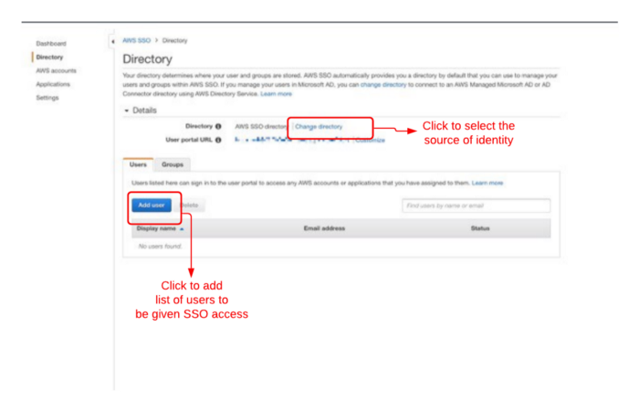

# AWS Single Sign-on (SSO)

## Hassle-free access management with AWS Single Sign-on (SSO)

### Introduction

AWS Single Sign-on is a single sign-on access providing service by Amazon web Services. AWS SSO allows you to access multiple AWS accounts and other Business applications just with a single access credential having them centrally managed. One of the painful processes is having to maintain several different access credentials and remembering which key is for which service. And this is where AWS SSO comes into the picture. How nice and convenient would it be if we could open multiple locked doors with the same key, eliminating the hassle of maintaining a bunch of different keys? Let’s deep dive and look into more interesting things you could do with the AWS SSO service.

### Let’s get started

You can access AWS SSO right from the [AWS Management Console](https://us-east-1.signin.aws.amazon.com/oauth?response_type=code&client_id=arn%3Aaws%3Aiam%3A%3A015428540659%3Auser%2Fhomepage&redirect_uri=https%3A%2F%2Fconsole.aws.amazon.com%2Fconsole%2Fhome%3Fnc2%3Dh_ct%26src%3Dheader-signin%26state%3DhashArgs%2523%26isauthcode%3Dtrue&forceMobileLayout=0&forceMobileApp=0&code_challenge=DNJywQV_kbc352eXdBUUtFCq6xlBx1YeYX737H8RkbY&code_challenge_method=SHA-256). The AWS Organisation Administrator can configure permissions and access controls for all the AWS accounts and users centrally without any complexity. Since all this work can be done in a single dashboard-like user portal, it eliminates the work of setting up the configurations manually on each account.

### Creating and managing user identities in AWS SSO

The AWS Organization Administrator can create new identities for individual users and even user groups within the AWS SSO user portal and manage them centrally all in one place. The AWS SSO also provides the facility of connecting existing user identities from third-party external user directories with the AWS SSO user directory. They include

- Microsoft Active Directory
- Okta Universal Directory
- Azure AD

And many more supported identity providers. [Click here to learn more](https://docs.aws.amazon.com/singlesignon/latest/userguide/supported-idps.html). You can also automate this process of granting users and user groups permissions by using *API*s and _AWS Cloudformation_ service.

### Auto-sync identities from other directories

After integrating user identities from any of the external directories mentioned above, user identities are automatically synchronized from those directories. This means whenever new identities are created or changes are made to the existing identities, it automatically gets reflected in the AWS SSO dashboard, eliminating the need for manual periodic synchronizations.

### Built-in integrations for other business applications

AWS SSO not only allows us to grant access to AWS accounts and services but also supports other business applications. To mention a few popular ones,

- Atlassian
- Dropbox
- Github
- G Suite
- Office365
- Salesforce
- Slack

Many more pre-integrated applications can be found here. [Click to view](https://docs.aws.amazon.com/singlesignon/latest/userguide/saasapps.html#saasapps-supported).

### Steps to setup AWS SSO in the Management Console

#### Step 1: Enable AWS SSO

- Log in to your [AWS Management Console](https://us-east-1.signin.aws.amazon.com/oauth?response_type=code&client_id=arn%3Aaws%3Aiam%3A%3A015428540659%3Auser%2Fhomepage&redirect_uri=https%3A%2F%2Fconsole.aws.amazon.com%2Fconsole%2Fhome%3Fnc2%3Dh_ct%26src%3Dheader-signin%26state%3DhashArgs%2523%26isauthcode%3Dtrue&forceMobileLayout=0&forceMobileApp=0&code_challenge=DNJywQV_kbc352eXdBUUtFCq6xlBx1YeYX737H8RkbY&code_challenge_method=SHA-256) on your favourite browser.
- Search for AWS Single sign-on in AWS Services.
- Make sure you have an AWS Organization setup. If not, click _“Create AWS Organization”_ to set one up.
- After setting up an organization, Click _“Enable AWS SSO”_ as shown below.

#### Step 2: Select the source of Identity

The AWS SSO store holds the identities of the users that are needed to be given access. You are also given the option to choose from the list of [supported external identity providers](https://docs.aws.amazon.com/singlesignon/latest/userguide/supported-idps.html) as the source of identity. As discussed earlier the AWS SSO also provides automatic synchronization of users from those external sources as well.

After adding users, they appear as a list of authenticated users. Now you can assign specific permissions to each user individually or put together a bunch of users as a user group and assign permissions to that group.

Here is a guide for setting up a few popular external identities:

- _AWS SSO Store_ - [managing user identities in default AWS SSO store](https://docs.aws.amazon.com/singlesignon/latest/userguide/manage-your-identity-source-sso.html).
- _Microsoft AD Directory_ — [Connect your Microsoft AD Directory with AWS SSO](https://docs.aws.amazon.com/singlesignon/latest/userguide/manage-your-identity-source-ad.html).
- _OKTA Directory_ — [Connecting with OKTA user directory](https://docs.aws.amazon.com/singlesignon/latest/userguide/okta-idp.html#okta-step2).

#### Step 3: Assigning SSO access to AWS Accounts and Applications

The AWS SSO provides authorized users with personalized _user portal_ access to several _AWS Accounts_ or _Applications_, using their credentials that were set up in AWS SSO.

##### AWS Accounts:

1. Inside the [AWS SSO](https://console.aws.amazon.com/singlesignon) console, Click on AWS Accounts.
2. Click _“Assign users”_ to add a list of users to specific AWS accounts that they can access using their AWS SSO credentials.
3. Create permissions set in the permissions tab. A [permission set](https://docs.aws.amazon.com/singlesignon/latest/userguide/permissionsetsconcept.html) is a set of permissions that can be assigned to _users or groups_.

##### AWS Applications:

1. In the [AWS SSO](https://console.aws.amazon.com/singlesignon) console, choose _Applications_ in the left navigation pane.

2. Select your desired application in the list.

3. Choose Actions, and then choose either Disable or Enable.

##### Other Business Applications:

The AWS SSO not only works with AWS Applications but also with other business’ cloud applications. A detailed guide for setting up AWS SSO credentials for those applications from other businesses can be found here. [Click to learn more](https://docs.aws.amazon.com/singlesignon/latest/userguide/saasapps.html#saasapps-addconfigapp).

### AWS SSO + IAM

When getting started with AWS, we start by creating an AWS Account. In that account, we first create an organization, and under that organization, we create one or more AWS user accounts. There is not much to worry about when there is just you and a friend, but in the case of a company, you will have many employees to be given access to AWS. So, you create IAM roles and permissions for several users and group them based on their type of job or department, etc. At the end of the day, you end up with many IAM roles and permissions for every single account added to the organization. It can indeed get complicated in handling the users and the IAM configuration. That’s one of the main reasons for AWS to come up with AWS SSO.

AWS SSO eliminates the work of managing users with IAM permissions by giving access to the users to handle their accounts. In SSO, all you have to do is to add the user to the AWS SSO directory and assign to them the required permissions. Then the users can log in to their accounts through the SSO user portal without any hassle.

From a security standpoint, when you have to assign IAM permissions to a user, you have to go to the specific user and alter their permissions or roles. When a user has to access something from another account, which is typically called cross-account access, the administrator has to give access permission to every AWS account. As long as it goes smoothly we don’t have a problem. The security of the sensitive components in the cloud is at stake when excessive permissions are assigned to undesignated personnel in the company. But in the case of AWS SSO, you can manage the users in groups all in one place and can be confident that the right person has the right access permissions without having to worry about things going wrong. Dealing with each user individually and assigning IAM permissions is what stands out in the case of SSO.

Let’s imagine a case where we have a user called Chloe. Now Chloe has access to her account ‘X’. She wants to access an S3 bucket that resides in another account, say ‘Y’. Now she has to assume a role that was assigned to her, which grants access to S3 service alone from her account ‘X’ and access the bucket in account ‘Y’. This role gives temporary credentials to Chloe with which she can access the S3 bucket in account ‘Y’. This is the main source of the pain because the administrator needs to deploy and manage many policies and roles across the AWS accounts.

### Conclusion

The SSO eliminates all these knick-knacks-looking jobs of configuring IAM access to users and makes it easy to handle user access management all in one place. It also eliminates the fear of security breaches from misconfigured IAM permissions and roles and the combination of AWS SSO and IAM just makes life easier in the world of AWS user management.
