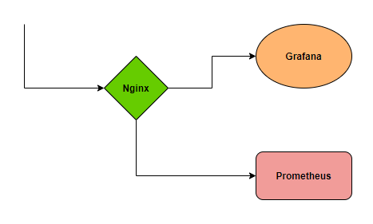
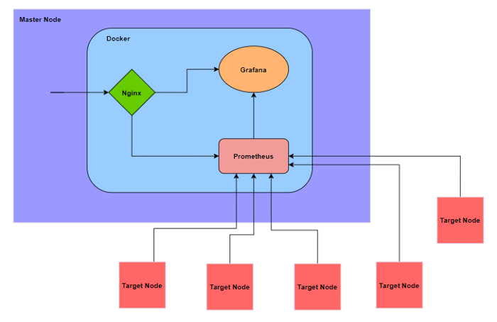
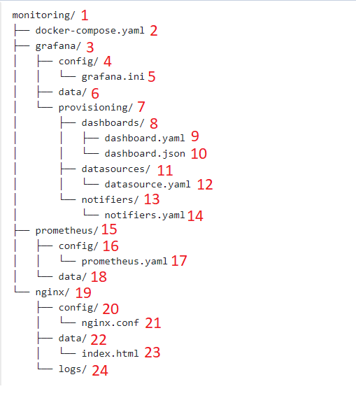
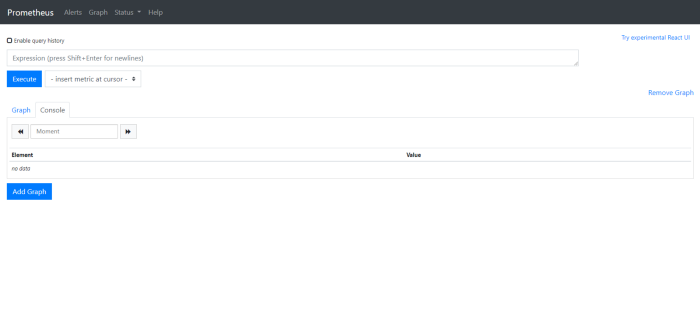
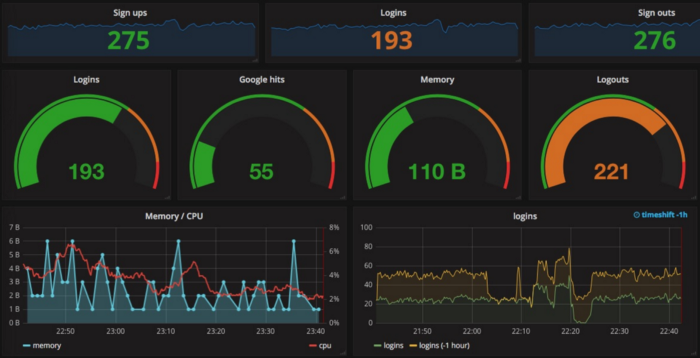

# Monitoring Linux Servers Using Prometheus and Grafana

## What is Prometheus?

[Prometheus](http://prometheus.io/) is an open-source tool for monitoring and alerting purposes. It was initially developed in 2012 and is a popular tool in the tech industry even today. This standalone and open-source tool does not belong to any company but is maintained independently as a part of the Cloud Native Computing Foundation since 2016. It makes use of a special type of flexible querying language called the PromQL and fetches metrics from servers and maintains them as time-series data. It also utilizes special purpose libraries and exporters for collecting metrics from third-party systems.

## What is Grafana?

[Grafana](http://www.grafana.com/) is an open-source visualization and analytics software. It turns your time series database data into visually appealing amazing dashboards and graphs. The data is usually provided by other metrics collecting and storing tools, in our case the time series data will be fed by Prometheus. It also allows us to create alerts for multiple thresholds and send alert notifications on the configured notifications channel.

## Let's get started with the monitoring setup:

We will be using docker containers for setting up Prometheus and Grafana. In addition, we would be running an Nginx container for the reverse proxy to route traffic internally.



Let's first understand the overview of the structure. For this blog, we will be deploying this stack on AWS and will be monitoring the servers in the account.

## Monitoring EC2 servers on AWS:

For the context of this blog, we will be monitoring _EC2 instances_ on _AWS_. But this is not limited to AWS and can be implemented on other cloud platforms and on-premise as well.

We will have one instance server as a host and we will call it the _Master node_. This node will be having the _Prometheus_, _Grafana_, and _Nginx_ containers running on docker. We will be using one of the exporters of Prometheus called the [node-exporter](https://github.com/prometheus/node_exporter) to scrape metrics from the target nodes. This exporter will be installed on all target nodes that we plan on monitoring and collecting metrics from.

## Architecture:



Referring to the architecture above, the target nodes that have node-exporter installed on them will send the metrics to Prometheus, from which the Grafana will collect the data and visualize it.

Let's start the initial setup from scratch,

Create a new folder with a name of your choice, We will call it _monitoring_.

The folder tree structure will look something like this,



Create the respective _files_ and _folders_ as above.

File 1: This folder will be the root directory.

File 2: `docker-compose.yaml` This docker-compose file will be used to spin up the different containers.

#### Sample

```yaml
version: "3.3"
services:
  nginx:
    image: nginx:1.19.4
    user: “0”
    container_name: nginx
    volumes:
      - ./nginx/config:/etc/nginx/conf.d
      - ./nginx/data:/usr/share/nginx/html
      - ./nginx/logs:/var/log/nginx
    ports:
      - “80:80”
    restart: on-failure
    networks:
      - my-network
  prometheus:
    image: prom/prometheus:v2.22.0
    user: “0”
    container_name: prometheus
    volumes:
      - ./prometheus/config:/etc/prometheus
      - ./prometheus/data:/prometheus
    ports:
      - “9090:9090”
    restart: on-failure
    networks:
      - my-network
  grafana:
    image: grafana/grafana:7.3.1
    user: “0”
    container_name: grafana
    volumes:
      - ./grafana/config:/etc/grafana
      - ./grafana/data:/var/lib/grafana
      - ./grafana/provisioning:/etc/grafana/provisioning
    ports:
      - “3000:3000”
    restart: on-failure
    networks:
      - my-network
networks:
  my-network:
    driver: bridge
    name: my-network
```

File 5: This is the config file for Grafana. A complete guide can be found here.

File 9: `dashboard.yaml`

This [file](https://grafana.com/docs/grafana/latest/administration/provisioning/#dashboards) contains information about the dashboard.

#### Sample:

```yaml
apiVersion: 1
providers:
  - name: "monitoring-dashboard"
orgId: 1
folder: ""
type: file
disableDeletion: true
editable: true
options:
path: /etc/grafana/provisioning/dashboards
```

File 10: JSON template of the visual dashboard.

Dashboards can be either created in the UI and exported as JSON templates or can be imported into the UI through a [JSON template](https://grafana.com/docs/grafana/latest/dashboards/json-model/).

File 12: `datasource.yaml`

This [file](https://grafana.com/docs/grafana/latest/administration/provisioning/#example-data-source-config-file) contains information about the data source, which will be Prometheus in our case.

File 14: `notifiers.yaml`

This [file](https://grafana.com/docs/grafana/latest/administration/provisioning/#alert-notification-channels) contains information about the notification channels that are used for sending alerts.

#### Sample:

```yaml
notifiers:
  - name:
type: email
org_id: 1
uid: notifier1
is_default: true
settings:
addresses: email@email.com
```

File 17: `prometheus.yaml`

This [file](https://prometheus.io/docs/prometheus/latest/configuration/configuration/) contains the list of all target nodes and their IP addresses from which it has to collect metrics.

#### Sample:

```yaml
global:
scrape_interval: 15s
scrape_configs:
- job_name: ''
scrape_interval: 5s
static_configs:
- targets: ['']
```

File 21: `nginx.conf`

This is the [configuration file](https://docs.nginx.com/nginx/admin-guide/web-server/reverse-proxy/) of Nginx which listens to external traffic and does reverse proxy.

#### Sample:

```conf
upstream @prometheus {
    server prometheus:9090;
}

upstream @grafana {
    server grafana:3000;
}

server{
    listen 80;
    server_name domain.com;
    root /usr/share/nginx/html;

    location /grafana/ {
        rewrite ^/grafana/(.*)$ /$1 break;
        proxy_set_header X-Real-IP $remote_addr;
        proxy_set_header X-Forwarded-For $proxy_add_x_forwarded_for;
        proxy_set_header X-NginX-Proxy true;
        proxy_ssl_session_reuse off;
        proxy_set_header Host $http_host;
        proxy_cache_bypass $http_upgrade;
        proxy_redirect off;
        proxy_pass http://@grafana;
    }

    location /prometheus/ {
        # rewrite ^/prometheus/?$ /prometheus/graph redirect;
        # rewrite ^/prometheus/(.*)$ /$1 break;
        proxy_set_header X-Real-IP $remote_addr;
        proxy_set_header X-Forwarded-For $proxy_add_x_forwarded_for;
        proxy_set_header X-NginX-Proxy true;
        proxy_ssl_session_reuse off;
        proxy_set_header Host $http_host;
        proxy_cache_bypass $http_upgrade;
        proxy_redirect off;
        proxy_pass http://@prometheus/;
    }
}
```

## Running the containers:

Inside the monitoring directory, where the docker-compose file is present, we can run the containers by using this command `sudo docker-compose up -d` This will spin up the three containers and map them to the specified ports.

## Installing node-exporter on target nodes:

The node exporter should be installed on all the target nodes that would need to be monitored and make sure their IP addresses are entered correctly in the configuration file of Prometheus in point 17. Installation of the exporter can be done by following the steps in this [document](https://docs.vmware.com/en/Management-Packs-for-vRealize-Operations-Manager/1.5.2/kubernetes-solution/GUID-A1B68BE5-EF38-48E1-AA80-FD71E6F19989.html).

Since the containers are up and running, we can view the

`Grafana at:3000`
`Prometheus at:9090`

But with Nginx reverse proxy setup we map a domain with the master node using the `nginx.conf` file and a _DNS record_ to point the domain to the master node.

After _mapping, the domain_ and _proxy_pass_ rules are written in the `nginx.conf` file, We can reach `Grafana`, and `Prometheus` through custom routes.

`domain.com/grafana`

and

`domain.com/prometheus`

## Reference images:

### Prometheus page:



### Grafana page:



## Conclusion:

These open-source tools are easy to use and less complex compared to other monitoring tools available. With community support and additional free plugins and packages, it can be integrated with additional features as well. All in all, Prometheus and Grafana can be the top tools to consider for monitoring Linux servers.
